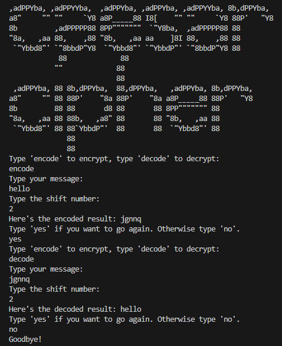

# Caesar Cipher

A terminal-based Caesar Cipher encryption and decryption tool built in Python. 
This classic cryptographic technique shifts letters in the alphabet by a specified number of positions.

## How to Use

1. **Download the Project Folder**: Clone or download the repository.
2. **Run the Cipher**: Open the file `playCaesarCipher.bat` to start the program in your terminal.
3. **Follow the Prompts**: 
   - Type `encode` to encrypt a message.
   - Type `decode` to decrypt a message.
   - Enter your message and the shift number when prompted.
   - The program will display the encoded or decoded result and ask if you want to go again.

## Example

## Running the Cipher

1. **Clone or Download**: Get the project files from the repository.
2. **Execute the Script**: Double-click `playCaesarCipher.bat` to start the terminal application.
3. **Interact with the Program**: Follow on-screen instructions to encode or decode messages.

Feel free to test it out and explore the classic Caesar Cipher encryption and decryption method!